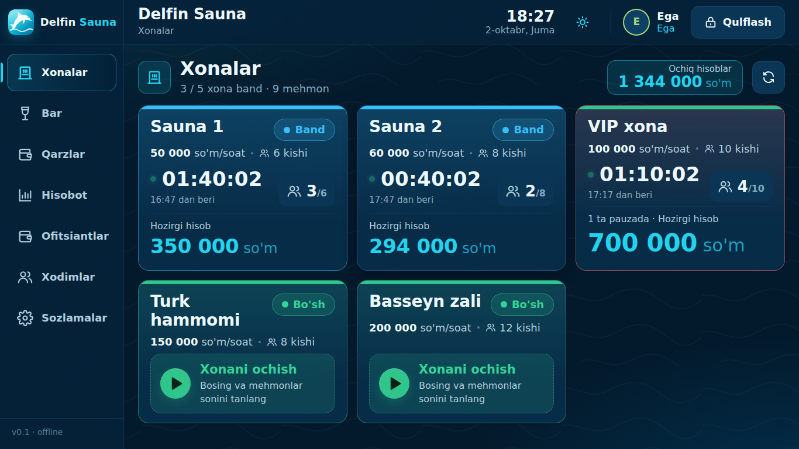
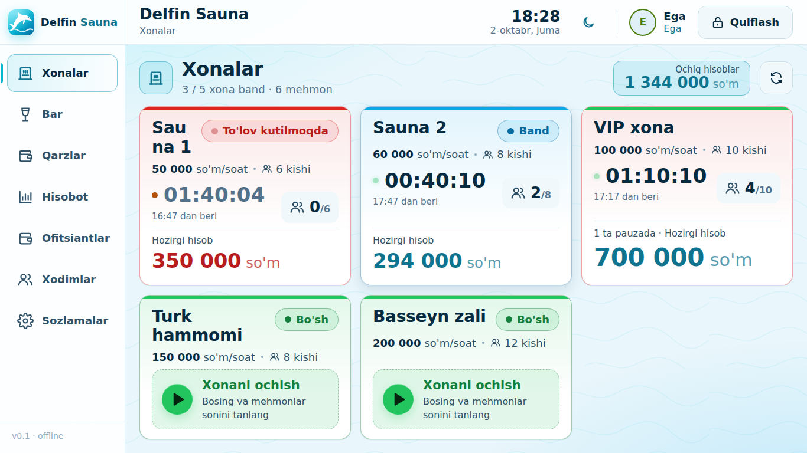
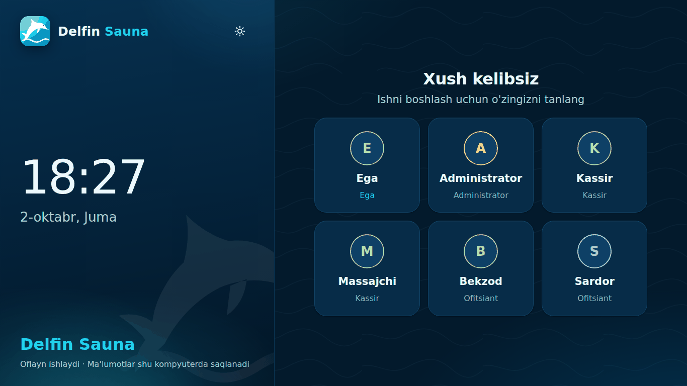
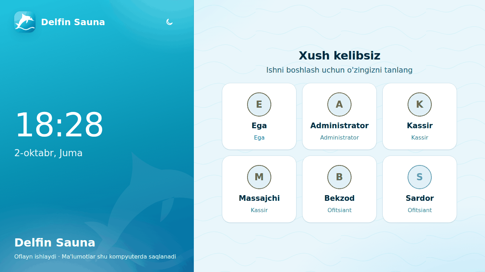

# Delfin Sauna

Sauna, hammom va shunga o'xshash bizneslar uchun **oflayn desktop POS**: xonalar va mehmonlar vaqti (soatbay hisob),
bar/mahsulotlar, xizmatlar, to'lov (naqd/karta/aralash/qarz), chek chop etish, qarzlar, xodimlar va hisobotlar.
Internet kerak emas — barcha ma'lumotlar shu kompyuterda (`%APPDATA%\DelfinSauna\delfin.db`).

Til: o'zbekcha (lotin). Pul: butun so'm. Interfeys: kunduzgi va tungi rejim (tepa paneldagi quyosh/oy tugmasi).

| Tungi rejim | Kunduzgi rejim |
|---|---|
|  |  |
|  |  |

## Texnologiya
- **Electron 22.3.27** (Chromium 108, Node 16.17) — Windows 7/8/8.1 va 32-bit uchun ataylab tanlangan, ko'tarilmaydi.
- React 18, zustand, Vite 7 (electron-vite), TypeScript.
- Baza: **sql.js** (WASM SQLite, native modul yo'q), har o'zgarishdan keyin atomik yoziladi.

## Ishga tushirish
```bash
npm ci
npm run dev          # Electron + Vite (hot reload)
npm run dev:server   # brauzer uchun: PosService HTTP /rpc orqali
npm run dev:web      # UI brauzerda (dev:server bilan birga)
```

## Tekshiruvlar
```bash
npm run typecheck     # tsc
npm test              # vitest: billing, PosService
npm run e2e           # Playwright UI testlari
npm run check:compat  # build + Chromium 108 / Node 16 mosligi (JS sintaksis/API, CSS)
```

## Build (Windows o'rnatuvchi)
```bash
npm run dist          # Windows'da: release/ → universal, x64 va ia32 NSIS o'rnatuvchilar
npm run dist:x64      # yoki dist:ia32, dist:dir (o'rnatuvchisiz papka)
```
GitHub Actions: `.github/workflows/build-windows.yml` (qo'lda yoki `v*` teg bilan).

## Arxitektura
```
src/shared/      turlar, ruxsatlar, billing (toza hisob), PosApi shartnomasi
electron/main/   sql.js DB, PosService (barcha biznes mantiq), IPC, chek/print
electron/preload window.api (contextBridge)
src/renderer/    React UI — faqat PosApi orqali ishlaydi
scripts/         dev-server, check-compat, make-icon
tests/           vitest va Playwright
```
Batafsil: [docs/ARCHITECTURE.md](docs/ARCHITECTURE.md).

## Eski Windows
Windows 7 SP1 / 8 / 8.1, 32-bit va 64-bit qo'llab-quvvatlanadi (Windows 7 da yangilanishlar talab qilinadi).
CSS/JS faqat Chromium 108 darajasida yoziladi (`:has()`, nesting, `color-mix()`, `structuredClone` main'da va h.k. yo'q) —
`npm run check:compat` buni avtomatik tekshiradi.
O'rnatish, ma'lumotlar joyi, zaxira, printer va muammolar: [docs/WINDOWS.md](docs/WINDOWS.md).
